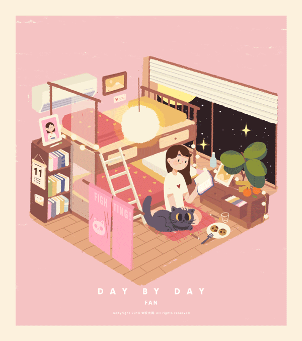

  

  # Hello, World! 👋
  
  Welcome to my digital workshop! I build some interesting, efficient, catchy and visually organised repositories and web tools.

  ---
  
  `🛠️ Python` &nbsp;•&nbsp; `📊 Streamlit` &nbsp;•&nbsp; `💻 Frontend Dev` &nbsp;•&nbsp; `💾 Git Versioning`

### 🔭 Project Showcases
Some of my projects which were my ideas and i reflected on it are:

* **stock trader:** A live real time profit/loss calculating tool with every detail of your asset.
* **movie chooser:** If you are confused or in double mind what to watch you can rely on it.
* **india demographics:** Live dashboard tracking state-wise live births, deaths, and infant mortality rates (IMR) from 1947 to 2026.
* **ticket comparison:** A simple frontend application to look up train schedules between stations and instantly find the cheapest available ticket option.
